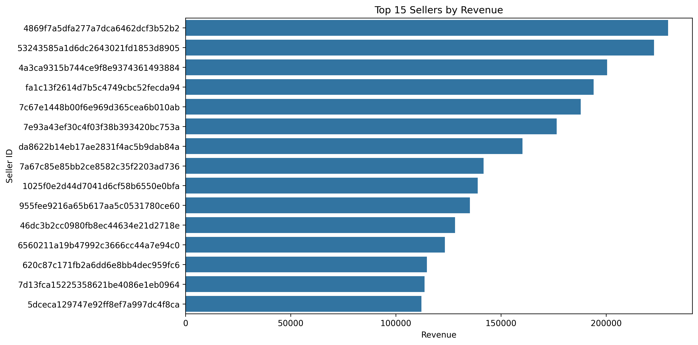

<div align="center">

# 🛍️ Retail Consumer Intelligence & Business Analytics Platform

### End-to-End Retail Analytics using Python • SQL • Power BI

<p align="center">


</p>

An end-to-end **Retail Business Intelligence** project built using the **Olist Brazilian E-Commerce Dataset**. The project transforms raw transactional data into business-ready insights through **Python, SQL, Customer Intelligence, and Power BI**.

It follows a production-style analytics workflow covering **data cleaning, feature engineering, SQL analysis, exploratory analysis, customer segmentation, and executive dashboard development**.

---

## 📊 Project Highlights

| Metric | Value |
|---------|------:|
| 📦 Raw Datasets | 9 |
| 👥 Customers Analyzed | 96K+ |
| 🛍️ Orders Processed | 113K+ |
| 🏪 Sellers | 3K+ |
| 📈 Visualizations | 20+ |
| 🗄️ SQL Modules | 8 |
| 🧠 ML Model | RFM + K-Means |
| 📊 Power BI Dashboards | 5 |

</div>

---

# 📚 Table of Contents

- Project Overview
- Business Problem
- Project Architecture
- Tech Stack
- Dataset Overview
- Project Workflow
- Key Features
- SQL Business Analysis
- Exploratory Data Analysis
- Customer Intelligence
- Power BI Dashboard
- Business Insights
- Installation
- Author

---

# 📌 Project Overview

Modern e-commerce platforms generate massive volumes of transactional data every day. Turning this raw data into actionable business intelligence is essential for improving customer retention, operational efficiency, and strategic decision-making.

This project demonstrates an end-to-end analytics pipeline that integrates Python, SQL, and Power BI to analyze customer behavior, sales performance, logistics, and seller operations.

Instead of focusing solely on dashboard creation, the project emphasizes data engineering, analytical thinking, customer intelligence, and business storytelling.

---

# 💼 Business Problem

Business stakeholders require a centralized analytics solution capable of answering questions such as:

- Which products generate the highest revenue?
- Which customers contribute the most value?
- How effective is the delivery process?
- Which sellers drive marketplace growth?
- Where are operational bottlenecks?
- How can customer retention be improved?

This project addresses these challenges by building an integrated Business Intelligence platform that converts raw marketplace data into interactive dashboards and strategic recommendations.

---

# 🏗️ Project Architecture

```text
                 Raw CSV Files
                       │
                       ▼
          Data Cleaning & Validation
                       │
                       ▼
            Feature Engineering
                       │
                       ▼
            Analytical Datasets
                       │
      ┌────────────────┼────────────────┐
      ▼                ▼                ▼
 SQL Analytics   Python Analytics   Customer Intelligence
      └────────────────┼────────────────┘
                       ▼
             Power BI Dashboard
                       │
                       ▼
          Business Insights & Recommendations
```

---

# 🛠️ Tech Stack

| Category | Tools |
|-----------|-------|
| Programming | Python, SQL |
| Analysis | Pandas, NumPy |
| Visualization | Matplotlib, Seaborn, Power BI |
| Machine Learning | Scikit-learn |
| Database | MySQL |
| IDE | VS Code, Jupyter Notebook |
| Version Control | Git & GitHub |

---

# 🗂️ Dataset Overview

The project uses the **Olist Brazilian E-Commerce Public Dataset**, containing transactional data from a Brazilian online marketplace.

| Dataset | Rows | Description |
|----------|-----:|------------|
| Customers | 99,441 | Customer information |
| Orders | 99,441 | Order lifecycle |
| Order Items | 112,650 | Purchased products |
| Payments | 103,886 | Payment transactions |
| Reviews | 99,224 | Customer reviews |
| Products | 32,951 | Product catalog |
| Sellers | 3,095 | Seller information |
| Geolocation | 1,000,163 | Geographic coordinates |
| Category Translation | 71 | Category mapping |

---

## 🗃️ Database Schema

<p align="center">


</p>

---

# 📂 Project Structure

```text
retail-consumer-intelligence-platform
│
├── data/
│   ├── raw/
│   ├── cleaned/
│   └── processed/
├── notebooks/
├── sql/
├── reports/
├── docs/
├── models/
├── powerbi/
├── images/
├── project_log.md
├── requirements.txt
└── README.md
```
---

# 🔄 End-to-End Analytics Workflow

The project follows a production-style analytics pipeline commonly used in retail and e-commerce organizations.

```text
Business Understanding
        │
        ▼
Data Collection
        │
        ▼
Data Cleaning & Validation
        │
        ▼
Feature Engineering
        │
        ▼
SQL Business Analysis
        │
        ▼
Exploratory Data Analysis
        │
        ▼
Customer Intelligence
(RFM + K-Means)
        │
        ▼
Interactive Power BI Dashboard
        │
        ▼
Business Insights & Recommendations
```

---

# ✨ Key Features

### 🧹 Data Cleaning & Validation

- Converted and standardized date & time columns
- Handled missing values using business-driven strategies
- Removed duplicate records
- Verified referential integrity across datasets
- Validated data types and business rules
- Exported clean analytical datasets

---

### ⚙️ Feature Engineering

Created reusable analytical datasets to support SQL, Python analysis, Machine Learning, and Power BI.

#### 📦 Sales Features

- Purchase Year
- Purchase Month
- Purchase Quarter
- Purchase Hour
- Purchase Weekday
- Delivery Time
- Shipping Time
- Delivery Delay
- Weekend Indicator

---

#### 👤 Customer 360

Customer-level analytical dataset including:

- Total Orders
- Total Products Purchased
- Total Spending
- Average Order Value
- Customer Lifetime
- Purchase Frequency
- Preferred Payment Method
- Average Review Score
- Repeat Customer Flag

---

#### 🛍️ Product Features

- Total Revenue
- Total Quantity Sold
- Average Product Price
- Average Freight Cost
- Revenue Category
- Product Rating Category

---

#### 🏪 Seller Features

- Total Revenue
- Total Orders
- Average Review Score
- Average Delivery Time
- Seller Tier
- Seller Rating

---

# 📂 Processed Analytical Datasets

The following business-ready datasets were engineered during the project.

| Dataset | Purpose |
|----------|---------|
| `sales_master.csv` | Master analytical dataset |
| `customer_360.csv` | Customer-level analytics |
| `customer_segments.csv` | Customer intelligence |
| `product_features.csv` | Product performance |
| `seller_features.csv` | Seller analytics |

---

# 🗄️ SQL Business Analysis

Business analysis was performed using modular SQL scripts covering different business domains.

## SQL Modules

| File | Purpose |
|------|---------|
| 01_data_loading.sql | Data import & setup |
| 02_data_validation.sql | Quality checks |
| 03_sales_analysis.sql | Revenue analytics |
| 04_customer_analysis.sql | Customer KPIs |
| 05_product_analysis.sql | Product insights |
| 06_seller_operations_analysis.sql | Seller & logistics |
| 07_advanced_sql.sql | Window functions & CTEs |
| 08_dashboard_kpis.sql | Executive KPIs |

---

### SQL Skills Demonstrated

- Joins
- Aggregate Functions
- CASE Statements
- Common Table Expressions (CTEs)
- Window Functions
- Ranking Functions
- Running Totals
- Rolling Calculations
- Business KPI Queries

---

# 📈 Exploratory Data Analysis

More than **20 visualizations** were created to analyze sales trends, customer behavior, product performance, seller operations, payment preferences, and logistics.

---

## 📊 Sales Analytics

✔ Monthly Revenue Trend

✔ Revenue by Quarter

✔ Revenue by Weekday

✔ Revenue by Purchase Hour

✔ Revenue by State

<p align="center">


</p>

---

## 👥 Customer Analytics

✔ Orders per Customer

✔ Repeat Customer Distribution

✔ Customer Spending by State

✔ Customer Value Distribution

<p align="center">


</p>

---

## 📦 Product Analytics

✔ Revenue by Product Category

✔ Top Selling Products

✔ Product Price Distribution

<p align="center">


</p>

---

## 🏪 Seller Analytics

✔ Top Sellers by Revenue

✔ Top Sellers by Orders

<p align="center">



</p>

---

## 🚚 Operations Analytics

✔ Order Status Analysis

✔ Delivery Time Analysis

✔ Delivery Delay Analysis

✔ Freight Cost Analysis

---

## 💳 Payment & Customer Satisfaction

✔ Payment Method Distribution

✔ Review Score Distribution

✔ Review Score vs Delivery Delay

<p align="center">


</p>

---

## 📊 Statistical Analysis

✔ Correlation Heatmap

✔ Histograms

✔ Distribution Analysis

<p align="center">


</p>

---

# 👥 Customer Intelligence

One of the core objectives of this project was to move beyond descriptive analytics and identify meaningful customer segments that can support retention strategies, personalized marketing, and customer lifetime value optimization.

The Customer Intelligence module combines **RFM Analysis** with **K-Means Clustering** to transform transactional data into actionable customer profiles.

---

## 🎯 Customer Segmentation Workflow

```text
Customer 360 Dataset
          │
          ▼
Feature Engineering
          │
          ▼
RFM Analysis
          │
          ▼
Feature Scaling
          │
          ▼
K-Means Clustering
          │
          ▼
PCA Visualization
          │
          ▼
Business Recommendations
```

---

## 📊 RFM Analysis

Customers were evaluated using three key behavioural metrics.

| Metric | Description |
|---------|-------------|
| 🕒 Recency | Days since the customer's most recent purchase |
| 🛒 Frequency | Total number of completed orders |
| 💰 Monetary | Total amount spent |

Each metric was scored from **1–5** to identify purchasing behaviour and customer value.

---

## 🤖 K-Means Clustering

Customer segmentation was performed using the following features:

- Total Orders
- Total Spending
- Average Order Value
- Purchase Frequency
- Customer Lifetime
- Recency
- Average Review Score

The Elbow Method identified **5 optimal customer clusters**, which were then visualized using Principal Component Analysis (PCA).

---

## 📈 Elbow Method

<p align="center">


</p>

---

## 🌐 Customer Clusters (PCA)

<p align="center">


</p>

---

## 📊 Cluster Distribution

<p align="center">


</p>

---

# 💼 Customer Segments

| Segment | Business Interpretation |
|---------|-------------------------|
| 🟦 Dormant Customers | One-time buyers with long inactivity periods. Ideal targets for win-back campaigns. |
| 🟧 Loyal Customers | Repeat buyers with strong lifetime value. Suitable for loyalty programs and cross-selling. |
| 🟩 Frequent Buyers | Active customers with regular purchases. High potential for upselling. |
| 🟥 Premium Customers | Small but extremely valuable customer group generating the highest revenue. |
| 🟪 New Customers | Recently acquired customers with strong potential for repeat purchases. |

---

# 📊 Power BI Dashboard

The engineered datasets were integrated into **Microsoft Power BI** to create an interactive Business Intelligence solution for executive decision-making.

The report consists of **five interactive dashboards**.

| Dashboard | Purpose |
|-----------|---------|
| 📈 Executive Overview | Business KPIs & revenue trends |
| 👥 Customer Intelligence | Customer behaviour & segmentation |
| 🛍️ Product Analytics | Product performance & sales |
| 🏪 Seller & Operations | Seller performance & logistics |
| 💡 Executive Insights | Strategic recommendations |

---

## 🖥️ Dashboard Preview

> Replace the placeholders below with your final dashboard screenshots.

### Executive Overview

<p align="center">

</p>

---

### Customer Intelligence

<p align="center">

</p>

---

### Product & Sales Analytics

<p align="center">

</p>

---

### Seller & Operations

<p align="center">

</p>

---

### Executive Insights

<p align="center">

</p>

---

# 💡 Key Business Insights

### 📈 Sales

- Revenue is concentrated in a small number of product categories.
- Quarter 2 generated the highest marketplace revenue.
- Afternoon and evening recorded the highest purchasing activity.

### 👥 Customers

- Most customers placed only one order.
- Repeat customers generated significantly higher lifetime value.
- Premium customer segments contributed disproportionately to overall revenue.

### 🛍️ Products

- Health & Beauty, Watches & Gifts, and Bed & Bath were among the strongest-performing categories.
- Product revenue follows a Pareto-like distribution.

### 🏪 Sellers

- A relatively small group of sellers generated a significant share of marketplace revenue.
- Seller performance varied substantially across the platform.

### 🚚 Operations

- Most orders were delivered successfully within expected timelines.
- Longer delivery delays were associated with lower review scores.

### 💳 Payments

- Credit Card was the dominant payment method.
- Installment payments were common for higher-value purchases.

---

# 🚀 Business Recommendations

- Increase investment in top-performing product categories.
- Launch targeted retention campaigns for dormant customers.
- Expand loyalty programs for repeat customers.
- Develop exclusive benefits for premium customer segments.
- Monitor seller delivery performance through operational KPIs.
- Reduce delivery delays to improve customer satisfaction.
- Use customer segmentation to personalize future marketing campaigns.

---

# 🚀 Getting Started

## Clone the Repository

```bash
git clone https://github.com/<YOUR_GITHUB_USERNAME>/retail-consumer-intelligence-business-analytics.git
```

Navigate to the project directory.

```bash
cd retail-consumer-intelligence-business-analytics
```

Install the required Python libraries.

```bash
pip install -r requirements.txt
```

Launch Jupyter Notebook.

```bash
jupyter notebook
```

Run the notebooks in the following order:

1. Data Cleaning & Validation
2. Feature Engineering
3. SQL Business Analysis
4. Exploratory Data Analysis
5. Customer Intelligence (RFM + K-Means)

---

# 📁 Repository Workflow

```text
Raw Dataset
      │
      ▼
Data Cleaning
      │
      ▼
Feature Engineering
      │
      ▼
SQL Analytics
      │
      ▼
Exploratory Data Analysis
      │
      ▼
Customer Segmentation
      │
      ▼
Power BI Dashboard
      │
      ▼
Business Insights
```

---

# 📈 Project Outcomes

This project demonstrates an end-to-end analytics workflow commonly used by Data Analysts and Business Intelligence professionals.

### Skills Demonstrated

- ✅ Data Cleaning & Validation
- ✅ Feature Engineering
- ✅ SQL Business Analysis
- ✅ Exploratory Data Analysis
- ✅ Customer 360 Analytics
- ✅ RFM Analysis
- ✅ Customer Segmentation using K-Means
- ✅ Power BI Dashboard Development
- ✅ Business Storytelling
- ✅ Executive Reporting

---

# 🎯 Future Improvements

Potential enhancements for future versions include:

- Interactive dashboard deployment using Power BI Service
- Automated ETL pipeline using Python
- Cloud data warehouse integration
- Real-time business monitoring
- Advanced customer lifetime value modeling

---

# 👨‍💻 Author

## Sahil Jangid

**Aspiring Data Analyst | Python | SQL | Power BI**

### Connect with Me

<p align="left">

<a href="YOUR_LINKEDIN_URL">

</a>

<a href="https://github.com/YOUR_GITHUB_USERNAME">

</a>

<a href="mailto:YOUR_EMAIL@gmail.com">

</a>

</p>

---

# 📄 License

This project is licensed under the **MIT License**.

Feel free to use this repository for learning and educational purposes.

---

<div align="center">

## ⭐ If you found this project helpful, please consider giving it a Star!

### Thanks for visiting the project! 🚀

Made with ❤️ using **Python, SQL & Power BI**

</div>