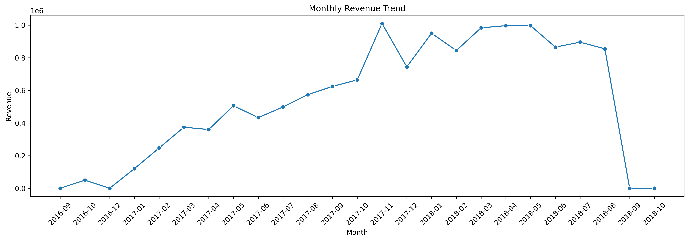
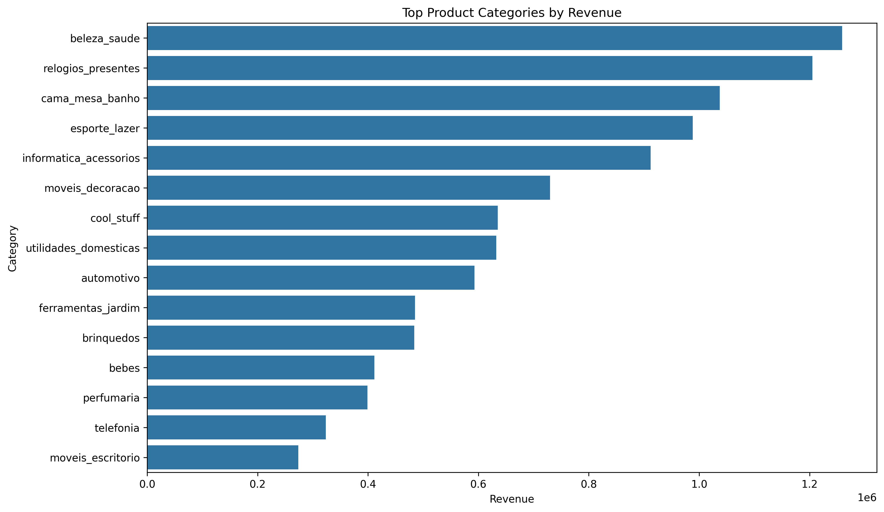
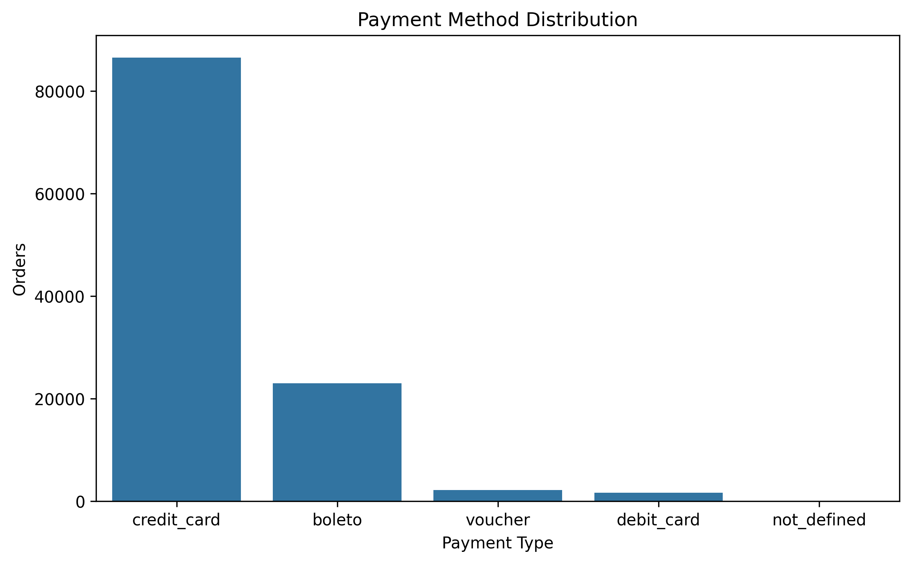
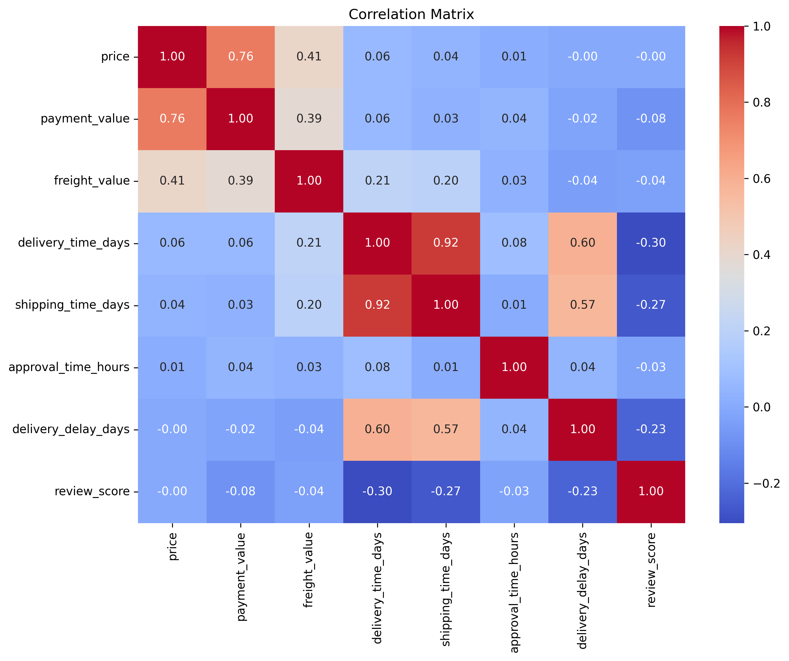
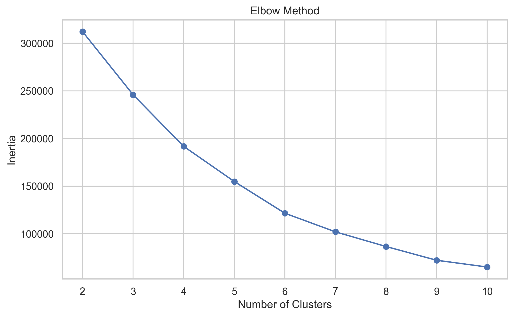
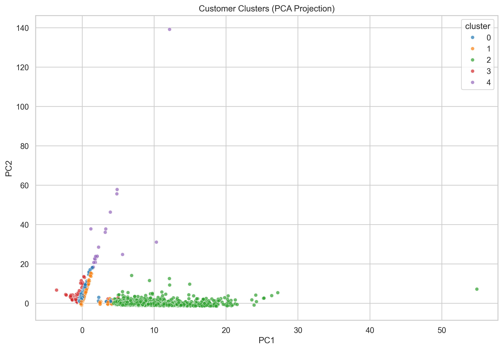
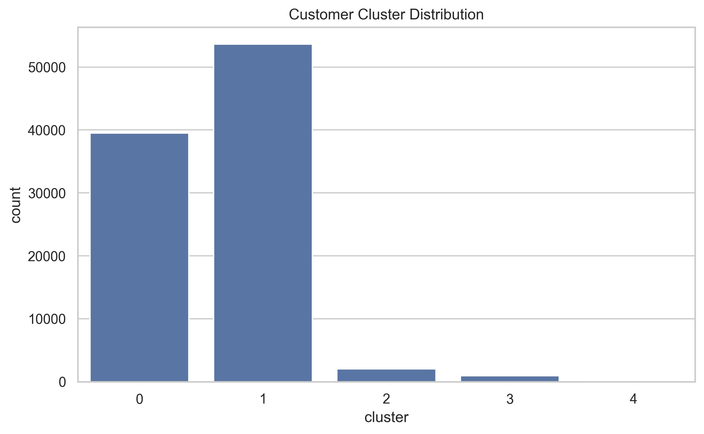

<div align="center">

# 🛍️ Retail Consumer Intelligence & Business Analytics Platform

### End-to-End Retail Analytics using Python • SQL • Power BI

<p>


</p>

**A production-style Retail Analytics platform built using the Olist Brazilian E-Commerce Dataset.**

Transforming raw marketplace data into actionable business insights through **Python, SQL, Customer Intelligence, and Power BI**.

</div>

---

# ⚡ 3-Minute Summary

### 📌 What is this?

A complete **Data Analytics portfolio project** that simulates how a Business Intelligence team analyzes an e-commerce marketplace.

Instead of focusing only on dashboards, the project follows a complete analytics lifecycle—from raw transactional data to executive-level business recommendations.

---

## 🚀 What was built?

- 🧹 Data Cleaning & Validation
- ⚙️ Feature Engineering
- 🗄️ Advanced SQL Business Analysis
- 📈 Exploratory Data Analysis
- 👥 Customer 360 Dataset
- 🧠 Customer Segmentation (RFM + K-Means)
- 📊 Executive Power BI Dashboard

---

## 📊 Dataset Scale

| Metric         | Value |
| -------------- | ----: |
| Raw Tables     |     9 |
| Orders         | 113K+ |
| Customers      |  96K+ |
| Sellers        |   3K+ |
| Visualizations |   20+ |
| SQL Modules    |     8 |
| Power BI Pages |     5 |

---

## 💻 Tech Stack

Python • SQL • Pandas • NumPy • Scikit-learn • Power BI • Matplotlib • Jupyter Notebook

---

## 🎯 Business Outcome

This project helps business stakeholders answer questions such as:

- Which products drive the most revenue?
- Who are the highest-value customers?
- Which sellers perform best?
- Where are delivery bottlenecks?
- How can customer retention be improved?

---

# 📷 Dashboard Preview

> Replace this image with your final dashboard collage.

<p align="center">


</p>

---

# 🔗 Quick Navigation

- [Project Overview](#-project-overview)
- [Tech Stack](#️-tech-stack)
- [Architecture](#️-project-architecture)
- [Key Features](#-key-features)
- [EDA Gallery](#-exploratory-data-analysis)
- [Customer Intelligence](#-customer-intelligence)
- [Power BI Dashboard](#-power-bi-dashboard)
- [Business Insights](#-key-business-insights)
- [Getting Started](#-getting-started)

---

# 📌 Project Overview

Retail companies generate enormous amounts of transactional data every day, yet converting that data into meaningful business decisions remains a challenge.

This project demonstrates how modern Data Analysts build reusable analytical datasets, perform business analysis, and communicate insights through interactive dashboards.

Rather than treating Python, SQL, and Power BI as separate tools, they are integrated into a single analytics workflow that supports strategic decision-making.

---

# 💼 Business Objectives

The platform was developed to answer critical business questions including:

- Revenue trends over time
- Customer purchasing behaviour
- Product category performance
- Seller efficiency
- Delivery performance
- Customer retention opportunities

---

# 🏗️ Project Architecture

```text
                  Raw CSV Files
                        │
                        ▼
          Data Cleaning & Validation
                        │
                        ▼
            Feature Engineering
                        │
                        ▼
            Business Ready Datasets
                        │
        ┌───────────────┼───────────────┐
        ▼               ▼               ▼
    SQL Analytics   Python Analysis   Customer Intelligence
        └───────────────┼───────────────┘
                        ▼
                Power BI Dashboard
                        │
                        ▼
          Executive Business Insights
```

---

# 🛠️ Tech Stack

| Category         | Tools                     |
| ---------------- | ------------------------- |
| Programming      | Python, SQL               |
| Analytics        | Pandas, NumPy             |
| Machine Learning | Scikit-learn              |
| Visualization    | Matplotlib, Power BI      |
| Database         | MySQL                     |
| Development      | Jupyter Notebook, VS Code |
| Version Control  | Git & GitHub              |

---

# 🗂️ Dataset Overview

The project uses the **Olist Brazilian E-Commerce Public Dataset**, which contains complete marketplace transactions from purchase through delivery.

| Dataset     |    Rows |
| ----------- | ------: |
| Customers   |  99,441 |
| Orders      |  99,441 |
| Order Items | 112,650 |
| Products    |  32,951 |
| Sellers     |   3,095 |
| Payments    | 103,886 |
| Reviews     |  99,224 |
| Geolocation |     1M+ |

<details>

<summary><strong>📖 View Database Schema</strong></summary>

<p align="center">


</p>

</details>

---

# 📂 Repository Structure

```text
retail-consumer-intelligence-platform
│
├── data/
├── notebooks/
├── sql/
├── reports/
├── powerbi/
├── docs/
├── images/
├── models/
├── README.md
└── requirements.txt
```

---

# ✨ Key Features

| Module                   | Description                            |
| ------------------------ | -------------------------------------- |
| 🧹 Data Cleaning         | Missing values, duplicates, validation |
| ⚙️ Feature Engineering   | Customer, Product & Seller features    |
| 🗄️ SQL Analytics         | Sales, Customer, Product & Operations  |
| 📈 EDA                   | 20+ visualizations                     |
| 👥 Customer Intelligence | Customer 360 & K-Means Segmentation    |
| 📊 Power BI              | Executive dashboards                   |

---

# 🗄️ SQL Business Analysis

Business analysis was performed using **8 modular SQL scripts** covering:

- Sales Analytics
- Customer Analytics
- Product Analytics
- Seller Performance
- Operational KPIs
- Executive Dashboard Metrics

The implementation demonstrates joins, CTEs, window functions, ranking functions, rolling calculations, and business KPI reporting.

---

# 📈 Exploratory Data Analysis

The analysis explores customer behaviour, sales performance, logistics, product demand, payment preferences, and seller operations.

## 📸 Visualization Gallery

| Revenue Trends                                                       | Customer Analysis                                                           |
| -------------------------------------------------------------------- | --------------------------------------------------------------------------- |
|  |  |

| Product Performance                                                     | Payment Analysis                                               |
| ----------------------------------------------------------------------- | -------------------------------------------------------------- |
|  |  |

| Statistical Analysis                                               |
| ------------------------------------------------------------------ |
|  |

---

# 👥 Customer Intelligence

To better understand purchasing behaviour, a **Customer 360 dataset** was engineered and combined with **RFM Analysis** and **K-Means Clustering**.

This enables the business to identify customer groups with different purchasing habits and design personalized retention strategies.

---

## 📊 Customer Segmentation Pipeline

```text
Customer 360
      │
      ▼
RFM Analysis
      │
      ▼
Feature Scaling
      │
      ▼
K-Means Clustering
      │
      ▼
Business Segments
```

---

## 📸 Segmentation Results

| Elbow Method                                                | PCA Cluster Visualization                                   |
| ----------------------------------------------------------- | ----------------------------------------------------------- |
|  |  |

| Customer Distribution                                               |
| ------------------------------------------------------------------- |
|  |

---

## Customer Segments

| Segment              | Business Strategy                            |
| -------------------- | -------------------------------------------- |
| ⭐ Premium Customers | VIP rewards & exclusive offers               |
| ❤️ Loyal Customers   | Loyalty & retention campaigns                |
| 🔁 Frequent Buyers   | Cross-selling & upselling                    |
| 🆕 New Customers     | Onboarding & first-repeat purchase campaigns |
| 💤 Dormant Customers | Win-back promotions                          |

---

# 📊 Power BI Dashboard

The engineered datasets were integrated into **Power BI** to create an interactive Business Intelligence solution for business stakeholders.

### Dashboard Pages

| Dashboard                | Purpose                           |
| ------------------------ | --------------------------------- |
| 📈 Executive Overview    | Business KPI Monitoring           |
| 👥 Customer Intelligence | Customer behaviour & segmentation |
| 🛍️ Product Analytics     | Product performance               |
| 🏪 Seller & Operations   | Seller performance & logistics    |
| 💡 Executive Insights    | Strategic recommendations         |

---

## 📸 Dashboard Gallery

> Replace the placeholders below with your final Power BI screenshots.

| Executive Overview                                               | Customer Dashboard                                              |
| ---------------------------------------------------------------- | --------------------------------------------------------------- |
|  |  |

| Product Analytics                                              | Seller & Operations                                           |
| -------------------------------------------------------------- | ------------------------------------------------------------- |
|  |  |

| Executive Insights                                              |
| --------------------------------------------------------------- |
|  |

---

# 💡 Key Business Insights

### 📈 Sales

- Revenue is concentrated in a relatively small number of product categories.
- Sales activity is strongest during afternoon and evening hours.
- Seasonal purchasing trends can support future marketing campaigns.

### 👥 Customers

- Most customers make only a single purchase.
- Repeat customers generate substantially higher lifetime value.
- Premium customers represent a small portion of the customer base but contribute significantly to revenue.

### 🛍️ Products

- A few product categories dominate marketplace revenue.
- Better-rated products generally achieve stronger sales performance.

### 🏪 Sellers

- Seller performance is highly uneven.
- A small group of sellers contributes a significant share of total revenue.

### 🚚 Operations

- Most deliveries are completed within the estimated delivery window.
- Longer delivery delays are associated with lower customer review scores.

### 💳 Payments

- Credit Card is the preferred payment method.
- Installment payments are common for higher-value purchases.

---

# 🚀 Business Recommendations

- Increase investment in high-performing product categories.
- Expand loyalty programs for repeat customers.
- Launch win-back campaigns targeting dormant customers.
- Reward top-performing sellers and monitor logistics KPIs.
- Use customer segmentation for personalized marketing campaigns.

---

# ⚙️ Getting Started

Clone the repository.

```bash
git clone https://github.com/sahiljangid04/retail-consumer-intelligence-platform.git
```

Move into the project.

```bash
cd retail-consumer-intelligence-platform
```

Install dependencies.

```bash
pip install -r requirements.txt
```

Launch Jupyter Notebook.

```bash
jupyter notebook
```

Run the notebooks sequentially to reproduce the complete analytics workflow.

---

# 📁 Explore the Repository

- 📓 **Notebooks:** `notebooks/`
- 🗄️ **SQL Scripts:** `sql/`
- 📊 **Power BI Report:** `powerbi/`
- 📈 **Reports & Figures:** `reports/`
- 📖 **Documentation:** `docs/`

---

# 🏆 Skills Demonstrated

- Python for Data Analytics
- SQL Business Analysis
- Feature Engineering
- Customer 360 Analytics
- Exploratory Data Analysis
- RFM Analysis
- Customer Segmentation (K-Means)
- Power BI Dashboard Development
- Business Storytelling
- Executive Reporting

---

# 👨‍💻 Author

## Sahil Jangid

**Aspiring Data Analyst | Python • SQL • Power BI**

### Connect with Me

<p align="left">

<a href="http://linkedin.com/in/sahil-jangid-8105b0313">

</a>

<a href="https://github.com/sahiljangid04">

</a>

<a href="mailto:sahiljangid09@gmail.com">

</a>

</p>

---

## ⭐ Support

If you found this project useful, consider giving it a **Star ⭐** on GitHub.

It helps others discover the project and supports future improvements.

---

<div align="center">

### 🚀 Thanks for visiting!

**Built with ❤️ using Python, SQL & Power BI**

</div>
